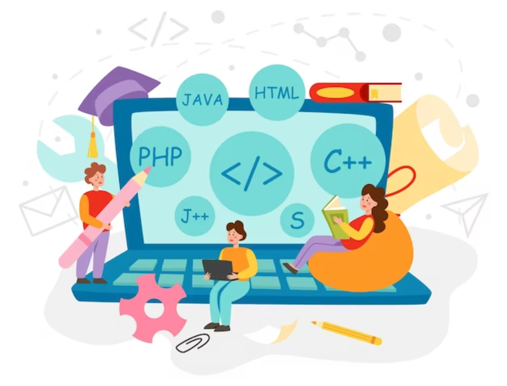

<h1 align="center"><b>Hi , I'm Ariana </b></h1>
<h3 align="center">Thank You for taking the time to view my GitHub Profile!</h3>

	
## <picture></picture> <b>About me</b>

 

<picture> </picture>

 

- 🌱 I’m currently learning everything about Frontend and Backend technologies as a self-taught student😅
- 💪🏼 Future Goals: Learn more technologies - Never stop creating new ideas.
- ⚡ Fun fact :  I like so much football⚽, music🎵, anime and cooking😋... and coding of course

 
 
 

##  <b>Skills - Languages and Tools</b>

 

 

              

 

## <b> Let's Connect..!</b>
 

    

 
